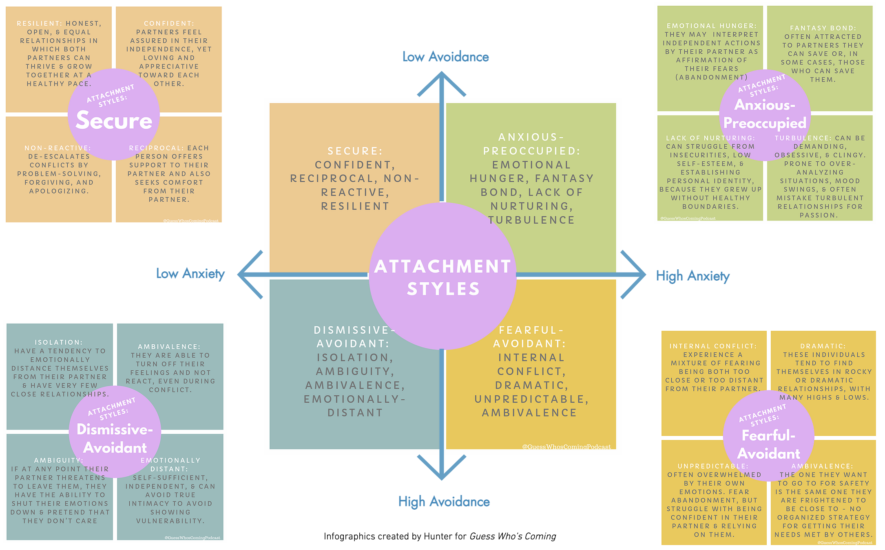

# Avoidant Attachment Explained
https://www.freetoattach.com/origins

Our attachment style is the way we tend to relate to others in intimate relationships. It develops in childhood from how our caregivers meet our needs, and can also be influenced by relationships and events as we grow up and later in life. Put simply, it might also be described as whether we move towards or away from people for comfort.

## Attachment Styles - a quick tour

We learn how to attach to our loved ones from our primary caregivers when we were children. Our caregiver’s ways of loving and caring for us teach us how to relate to those closest to us. Specifically, how our caretakers handled our upset feelings and how they handled their own upset feelings dramatically affects how a person treats their partner and views relationships and closeness in the future. If a child develops a healthy attachment to a caregiver, he or she will be more likely to consider relationships safe, reliable, and important and will have the security and confidence to explore the world around them.

In adolescence, our peer group takes on a larger role in our lives as we continue to learn how to relate to others and express (or repress) our needs. These experiences further influence our attachment style as we eventually have romantic relationships, which, in turn, also influence our attachment style, in addition to important life events. So while your early experiences do have a considerable influence on how your relate to others, it’s not the only factor that determines your attachment style. Attachment styles represent primal fears around being protected by a caregiver, so are triggered in our close relationships (hence we may, for example, find ourselves perplexed by how anxious, dependent or trapped a partner makes us feel when we happily operated independently out of the relationship), as well as triggering in our responses to traumatic events.

There are four different attachment styles - secure attachment, and three insecure styles.

The securely attached grew up receiving the consistent message they were worthy of love, stability and their needs being met, which enabled them to develop a healthy self-esteem. All insecure styles were taught to feel to some degree (and this often is very unwittingly done) that their emotional and/or physical needs would not always be met. At the root this made them fear they are unworthy of love or their needs being met, and so they live with a low-level operating belief they are somehow 'not good enough'. This makes it more difficult for people with insecure attachment styles to know their boundaries and feel confident expressing their needs. As a result they are more likely to self-abandon to meet the needs of others, which can then lead to resentment and cycles of relationship instability.

### Secure (50% of population)

> People with a secure attachment style are comfortable both giving and receiving love, displaying interest and affection or being alone and independent. They feel secure and connected while allowing partner to move freely. They find it easy to be close to others, are comfortable depending on them and don’t mind being depended on. They rarely worry about being abandoned or someone getting too close to them. They have a positive self-view and perceive others positively. They are comfortable offering and seeking support, apologising and resolving conflict. They have an accepting attitude and talk things through to get to the bottom of and fix problems. They see the benefit of fighting through pain and hardship, though they also tend to draw clear boundaries and stick to them. They expect that when they express feelings their needs will be met, so their relationship tends to be honest, open and equal and they tend to be more satisfied in their relationships. They can easily end conflicts, are mentally flexible, good communicators, being able to express their needs less likely to suffer mood swings, and don't play games. People with a secure attachment are comfortable in intimacy, are not preoccupied to establish space in their personal relationships, are forgiving, are inclined to see sex and emotional intimacy as a whole, and treat their partners with empathy, concern, love and respect. They also feel responsible for the wellbeing of their partner. These beliefs give them the capacity to ask for what they want in a relationship or ask for clarity. They don’t feel they have to manipulate or convince someone they are good enough. Secure attachers can use both co-regulation (regulating around others) and auto-regulation (regulating alone) to regulate their emotions.

### Dismissive Avoidant (25%)

> People with dismissive avoidant attachment have the tendency to emotionally distance themselves from their partner. Their caregivers consistently failed to meet certain needs (such as emotional support), so they learnt to suppress those needs and emotions and to self-soothe, meaning that even though they have a natural human craving for connection, at heart they feel safest alone. They generally rely on auto-regulation of their emotions as they did not learn to be comforted around others. They are convinced they are better off distancing from a partner except for the idealised person they imagine in their past or future, and are more often single. Because the caregiver experience could be stressful rather than soothing, their core wound is around engulfment. Believing in self-reliance, they tend towards a negative view of others and positive view of themselves (although this is masking a low self-esteem). More on this below!

### Anxious Preoccupied (20%)

> Anxious attachment styles felt some inconsistency from their caregivers (or alternatively incongruency between the abilities of different caregivers to provide for their needs), and had to make an effort to get their needs recognised, which programmed them to expect to have to work for love and to fear rejection (although still believing others have the capacity to soothe them), and so their core wound is around abandonment.  They have a strong craving for intimacy, tend to regulate their emotions through co-regulation (being around others) and require reassurance and affection from their partner, but they expect to work to have to receive it and so can be drawn to perceived challenge. They can be hyper-sensitive to rejection cues, may have difficulty trusting others won't leave them and have trouble being alone or single. At the more extreme end they can be emotional, unpredictable and moody and may become clingy, demanding and even manipulative in their quest for security. They feel unworthy, having a positive view of others and negative view of themselves.

### Fearful Avoidant (5%, also known as Disorganized)

> These people came from homes where there could be a lot of instability and chaos, where they learnt they couldn't trust their caregivers to meet their needs, so their core wound is around trust. There may have been abuse or addiction in the home. They exhibit both dismissive and anxious traits, afraid of being either too close to or too distant from others. In other words, the person they want to go to for safety is the same person they are frightened to be close to. As a result, they have no organised strategy for getting their needs met by others. They may cling to their partner when they feel rejected, then feel trapped when they are close. While deeply craving intimacy and commitment they may also distrust and lash out at anyone who tries to get close to them, and their relationships can be quite turbulent. They attempt to keep their feelings at bay but become overwhelmed by their reactions and often experience emotional storms. They are hyper-vigilant for threat cues (like the anxiously attached), but simultaneously uncomfortable when things get too close and stable (like dismissive avoidants). They tend to have a negative view of others and themselves.

But no one wants to be put in a box: these aren't monolithic qualities and most people do not fit the attachment style prototypes perfectly; instead, researchers measure attachment style as a spectrum, which everyone exists on to some degree. “Avoidant”, “secure” and “anxious” are changeable patterns of relating *between people* rather than something that lives within people as an essential identity. And these are dimensions, not categories; people can locate their responses along a continuum depending on many contextual and relational factors. So although everyone has one dominant style, we can exhibit tendencies of more than one style and it can change over time and in different situations. Usually people have a primary attachment style and secondary characteristics of another.

For example, we may be part secure attachment, part anxious, but our anxious attachment can show up more in certain interpersonal dynamics and certain times in our lives that trigger our attachment systems to a greater extent. Most of us lean towards an insecure style in difficult moments. For example, an insecure relationship would naturally make us act in anxious ways. And often we may present as secure when times are good, but it is in hard times that everyone's natural attachment style is triggered. Some people are lifelong avoidant/anxious, others may just present as such temporarily in the aftermath an event that made them feel particularly vulnerable (eg breakup, divorce, job loss, death). And people with low self-belief may present as avoidant in some situations and anxious in others - the common driving force is the feeling of unworthiness learned in childhood. But all this malleability means that it can also become in our control.
	
Half the population has an insecure attachment style (more in the dating pool) and everyone can exhibit elements to some degree in different situations - it's completely, boringly normal. So don't try to judge, shame or write off yourself or a partner if you think you/they might be demonstrating one! Most people just aren't aware. Attachment theory is simply one method to give us even deeper insight into the process of how we relate to others, and awareness of dynamics that can affect our relationships. With awareness comes ability to control, and we can choose to reprogram ourselves to enact the dynamics that will make us happiest, and our relationships strongest. The key here for happiness in a relationship is simply to both become aware of your natural tendencies towards a particular style and to each take responsibility for catching your patterns before you descend into them.

## Where does avoidant attachment come from?

### Cause: some neglect or enmeshment

You'll have noticed there are in fact two types of avoidant attachment - Dismissive Avoidant and Fearful Avoidant. This site focuses on the first, which is much more common (if you believe you have a Fearful Avoidant attachment style some of this will still be useful, plus check out related videos on fearful avoidants). At the core of avoidant attachment, as with other insecure attachment patterns, is a lack of self-love from experiences that have giving rise to the subconscious belief we are not worthy of our needs always being met.

In a dismissive avoidant attachment, the parent may or may not meet the child’s physical needs, but he or she will consistently have some trouble responding to the child on an emotional level, denying their needs or opinions. This could be through a degree of neglect, such as parents who are absent/working a lot, emotionally distant, inattentive to or just have little time for their children (perhaps it being divided with many other siblings, illness in the family, or the caregiver is struggling with grief/their own difficulties), some emotional incapacity on the part of the caregiver stemming from their own attachment wounds, or if children are sent early to boarding school etc (there is an association of avoidance with the childrearing practices of some subcultures, for example British establishment institutions which are infused with an ethos of self-sufficiency, and the British tradition of the 'stiff upper lip'). Parents may physically or emotionally reject or disengage from their children. They may routinely refuse to recognise their child’s cries or other shows of distress or fear, actively suppress their child’s displays of emotion by telling them to stop crying, grow up or toughen up, become angry or physically separate from a child when they show signs of fear or distress, shame a child for displays of emotion, have unrealistic expectations of emotional and practical independence for their child, or simply not acknowledge their emotions when they come up. The huge unsoothed emotions the child is left with are just too much for their little body and leave a deep trauma wound.

Alternatively/additionally it can be just being emotionally unattuned - parents who are for example overbearing, critical, or controlling & smothering, prioritising their own emotional needs, using the child for support or deriving their own sense of connection and self from the child. The parent may have been more interested in what they had to say than really hearing the child, and/or the child may have come from a family of dominating personalities. Children from this background may have felt obligated to fulfil the needs/attention/ambitions of their caregivers, responsibility for siblings or later the needs of their peers, receiving reward for these rather than their own needs always being looked out for independently. This is a form of 'enmeshment' (where children are made responsible for their parent’s needs). Protecting the parent's own image or the image of the perfect family may also have been more important than allowing the child to show feelings and meeting their real emotional needs. As a result the child can feel capable, in terms of being useful to their family, but not very lovable, while at the same time developing defences to avoid feeling these feelings.

In situations of both neglect and enmeshment, parents tend (whether consciously or not) to disregard their children’s needs to a degree and encourage them to “grow up” and be independent before they’re ready. One way or another, the child is encouraged to be a certain way rather than to be themselves. They develop a 'False Self' where the child's preferences are stymied in favour of the parental vision, to secure a place within the family system.  There can be an emphasis on family members performing a role to each other, rather than sensitive inquiry into feelings, which then becomes the area where the avoidant feels safe.

In a famous [experiment](https://www.researchgate.net/publication/277026014_Ainsworth's_Strange_Situation_Procedure_The_origin_of_an_in), researchers had parents briefly leave the room while their infants played to evaluate attachment styles. Infants with a secure attachment cried when their parents left, but went to them and were quickly soothed by their presence when they returned. Infants with an avoidant attachment appeared outwardly calm when the parents left, but avoided or resisted having contact with their parents when they returned. Despite the appearance that they didn’t need their parent or caregiver, tests showed these infants were just as distressed during the separation as the securely attached infants. They simply didn’t show it. They then ignored the returning caregiver and focused on toy play as a defensive diversionary activity to avoid painful rejection, but unlike in true play their heart rate did not decrease. They were not shifting attention to the toys as much as away from the parent.

Unlike the securely attached, who learn to expect their needs will be consistently met, or the anxiously attached, who learn they must work, fight or sacrifice to get those needs recognised, the avoidant child simply accepts and internalises emotional abandonment - that their needs will not be met - and learns not to try. So avoidant children then often go unnoticed because they are considered “good” and “well-behaved” and “never a bother.” By all appearances, the avoidant child seems independent; however, this appearance of autonomy is the child’s adaption to his or her caregiver’s low valuation of attachment behaviours. True independence cannot effectively be achieved by way of neglect. 

> #### Psychobabble: Enmeshment
>
> **Proper Bonding:**  Functional emotional connection from parent to child that is rooted in a mature, stable place, that nurtures and supports the child.
>
> **Enmeshment:** The energy flow is extracted from the child to nourish the parent.  Enmeshed children get drained and used by the caregiver's need for companionship, attention, and love. Children grow up to become avoidantly attached. 
>
> Enmeshment is a form of emotional incest. Parents who draw their children into their relationship may be too immature to be emotionally intimate with another adult at times; they find it threatening and painful. They may not be in a secure relationship themselves, and are deprived of a partner's full support and emotional connection. But they realize they can be intimate with their children because the children are vulnerable and won’t abandon them, but must stay near them for survival. Avoidants can grow up feeling very good about themselves in their role in the family of origin because they feel special to have a role taking care of one or both parents. They learn that to be connected means they get to be the High Power to someone else, and yet it also means to be drained (engulfed).

### Result: self-denial of needs, self-blame, emotional suppression & distrust

Where a parent unconsciously can’t attune to their child and hold space for their child’s needs, feelings and boundaries, the child performs who they are according to their family’s needs (a role they may still play out as adults, some even still living at home for a long time), and internalises the blame of that childhood emotional or physical abandonment. Children in this situation learn that the best way to get their needs met by their parent is to act like they don’t have any. Seeking affection when they were scared or in pain could lead to a negative outcome, so they adjusted accordingly by learning to avoid expressing their needs and wants, and to keep an emotional distance from others to be safe. So they create defences to make sure no one knows their real feelings and can use these against them.

As a result, they adapt by becoming removed from their own emotions and developing a pseudo-independent childhood stance, (“I can take care of myself: don't trust anyone”). This early lack of emotional closeness can make it hard for children to be in touch with their own desires or take a chance on getting close to others once they’ve grown up, because they have stored negative associations with showing themselves. They have learnt that love means sacrificing their own needs, potentially being controlled, smothered and/or at risk of abandonment.

> "Some avoidant children can become good readers of other people's emotional states (though not their own). It makes sense to gauge the other person's expectations if you are anxious about being rejected when you get things wrong but accepted when you get things right. Being seen as competent and successful by other people feels safer than being intimate and open. Although parents might reject and devalue children's attachment needs, parental approval and regard are granted when children achieve task competence, physical prowess, or academic success. Positive self-regard is therefore conditional on the self being able to contain emotion, and the self seeing itself (and believing it is seen by others) as competent and in control. This produces an achievement-orientated personality, which over time might lead to perfectionist tendencies, workaholism and the drive for material success. They expect validation or praise from doing things, not in and of themselves, because without these external competencies the self is not worthy.
>
> For avoidant children the emotion most likely to erupt is anger because anger serves to keep others at bay. They relate with others somewhat defensively, always anxious that the self, if viewed too closely, isn't going to be likeable or good enough, a self that might therefore be rejected. So children are more likely to select friends with similar attachments to their own. They focus on factual conversations as an impersonal, non-emotionally based way of getting close to people. And in play they avoid storylines that get into any sort of difficulty, where need or emotion might have to be displayed. They immobilise the attachment system by excluding fear, pain and sadness from conscious awareness."

\- Attachment across the Lifecourse

> #### Psychobabble: The Assumption of Non-Mutuality
>
> Because the avoidant is born out of a dismissive/derogating parenting style, the basic experience of relationships as non-mutual becomes concretised in early childhood. The dismissive parenting style values things and self over relationship and attachment. The experience of true mutuality is replaced by basic insecurity about the self and other; the attachment relationship is not safe or secure and it is not held together as much by attraction as by fear, either of loss of self or loss of other.
>
> The avoidant bristles in response to an approaching primary attachment figure because he or she does not believe in mutuality. The approaching figure wants something from him or her, and reciprocity is not possible. This leaves the avoidant in a dilemma that can only be resolved with compliance, withdrawal, anger, or avoidance. The avoidant experiences shame and fear with the emergence of aversion toward the primary attachment figure. He or she fears the other will recognise this aversive reaction, and because the cause of this reaction is a mystery even to the avoidant, the experience is one of shame: “There is something wrong with me.”
>
> The therapist can help both the avoidant and his or her partner understand that true mutuality and inclusion are foreign to the avoidant, who believes he or she is only needed and never really wanted. Feeling needed but not wanted is a central attachment injury for the avoidant, who had to adapt to a non-reciprocal, dismissive, or derogating caregiver.
>
> Insight for the avoidant is notoriously poor, and problems with autobiographical memory and somatoaffective awareness are noted. The avoidant’s declarative memory is filled with ideas about parents and childhood, but lack autobiographical memories filled with the experience of parents and childhood. Most often, the avoidant’s report is idealised, lacking in detail, and superficial. For this reason, the avoidant is largely unaware of his or her attachment dilemma, and because adaptation has been so complete, he or she does not appear distressed and tends to see nothing wrong with his or her avoidant strategies.

### Complete adaptation: denying the origin

> "Dismissing attachment is characterized by the avoidance of feelings, memories, or longings that might drive away the attachment figure. This is avoidance in the service of proximity. Because attachment behaviour has as its aim the maintenance of proximity, the function of this avoidance is to disable feelings and ideas that threaten the real or perceived relationship. By deactivating attachment in this way, the patient shifts attention away from memories of potentially painful relationship episodes with caregivers, thereby avoiding possible threat to his or her characterisation of the relationship. Such memory processes are adaptive - forgetting certain kinds of betrayal experiences from a primary caregiver can be necessary for the individual’s survival."

\- in other words, the function of this suppressing adaptation was to deny feelings in the service of maintaining a close relationship with a caregiver, even if parts of that relationship had given the child pain. Avoidants had to train themselves to be emotionally unattuned for protection. While around their family, it is strongly in their survival and social interests to repress rather than recognise, and to divert their frustrations from the original source. Consequently as adults, people with an avoidant attachment style may have a difficult time recognising the origins of their patterns and often initially report happy childhoods or struggle to remember. They often have poor access to early emotional memories, having built a defensive shield of self-esteem and self-sufficiency that requires negative memories to be suppressed. So the avoidant preservation strategy is to avoid confronting any negative memories. They will speak vaguely about their childhoods and often describe them in idealised terms, though when pressed for incidents that might illustrate these descriptions, their memories can contradict their assessments. Denial is an effective shield against pain- avoidants would prefer not to reflect on such things but when asked directly tend to downplay the significance of events that would be expected to cause distress and rationalise any harsh treatment towards themselves ("they didn't mean it," "it did me good" etc). Such idealisation of the parental relationship can also contribute to the 'perfect partner' relationship fantasy, where no partner can measure up to the mythologised parental union.

> "I have never known a patient to portray his parents more negatively than he actually experienced them in childhood, but always more positively - because idealisation of his parents was essential for survival"

\- The Flight From Intimacy, Weinhold & Weinhold

Of all styles, avoidants particularly struggle to acknowledge their parents may have been at all damaging because of the uncomfortable emotions it will unleash - avoidants are used to suppressing emotions. In therapy the person's 'forgiveness' for their caregivers is often at the expense of real compassion for themselves as a child. They shoulder the burden of responsibility for their own unhappiness. It is easier for the child to believe themselves unworthy of love than to perceive their attachment figures as incapable of loving them, but this survival strategy comes with a lifelong price including a lifelong sense of self-criticism, guilt and shame.

But it's worth noting that many people with insecure attachment styles can come from overtly very happy family backgrounds and loving homes - given that insecure styles represent half the population, it's just very easy to happen. Our parents can't be there to meet our needs 100% of the time. And when parents aren't aware of and alert to their own attachment patterns, insecure styles are often passed down families in cycles that repeat themselves. The best predictor of a child’s security of attachment is in fact not what happened to his parents as children, but rather how his parents made sense of those childhood experiences - if they could acknowledge and respond to their own attachment patterns.

> #### Psychobabble: How We Carry Trauma
>
> From [this](https://www.psychologytoday.com/gb/blog/mindful-anger/201804/9-steps-healing-childhood-trauma-adult) article about Trauma: "trauma generates emotions, and unless we process these emotions at the time the trauma occurs, they stay in our unconscious until we process it. The healthy flow and processing of distressing emotions such as anger, sadness, shame  and fear is essential to healing childhood wounds as an adult.
>
> The healthiest response to childhood wounds is also the rarest: when the trauma first occurs, we recognise the violation in our sense of self, feel the natural emotions that follow, and then realise that the violation doesn't say anything about us personally - and thus we don't make negative meaning of it and can let it go. But because emotions like anger and sadness are painful - and because crying or confronting others is often not socially acceptable - this process doesn't happen automatically. Instead we may suppress our emotions rather than feel and process them. As a child this process is even more difficult. What can feel like a pinprick to an adult can feel like a stab wound to a child and create lasting damage. Then we carry these emotional stab wounds into adulthood and they affect our relationships, career, happiness, health, everything... until we process them and heal by feeling our feelings."

## What does this mean for adults?

When our attachment figures cannot tolerate us being demonstrative, needy or unhappy, as children we tend to shut off from those needs and wishes to remain close to caregivers without alienating them. The cost is that we disavow aspects of ourselves and, in effect, shut down some of the richest aspects of human life. We feel safest around others when we are playing a role, which means we may struggle to be vulnerable enough to sustain close relationships, because it inherently makes us feel unsafe. This can also mean we expect we need to act perfectly (as we perfectly adapted to meet our family's needs), and easily fear we will not match up to expectations. Avoidants must feel competent at all times to feel safe, and one of their biggest fears is being 'revealed' as somehow incompetent.

Essentially, people with avoidant attachment styles often had parents who dismissed or overlooked their feelings or emotions, especially any negative emotions. When these parenting styles persist, these children, and then adults unconsciously follow the following relationship rules: other people are not reliable, dependable or trustworthy to care for my needs and I must rely on myself alone to tend to these needs. Emotional vulnerability is deeply equated with rejection, so they must resist becoming vulnerable or getting too close. They struggle to connect with others who attempt to connect or form a bond with them. They might enjoy the company of others but actively work to avoid closeness due to a feeling that they don’t — or shouldn’t — need others in their life. They tend to rely heavily on self-soothing techniques so they can continue to suppress their emotions and avoid seeking out attachment or support from others outside of themselves. They might also struggle to verbalise when they do have emotional needs, and be quick to find fault in others. And because their sense of self became unduly linked to a caregiver's needs, in adulthood partners expressing needs can be interpreted as an innate criticism of them, which quickly becomes overwhelming.

The problem is a strong disconnect between an avoidant's conscious thoughts and their emotional system. Consciously avoidants want connection, but unconsciously closeness is a primal threat and triggers an anxiety response which prompts them to pull away.

Avoidant attachment is widely distributed across genders though more common in men because of cultural conditioning - the simple reason that as little boys and growing up they were more likely to be shamed for or discouraged from expressing their feelings ("don't cry like a girl"). Even equality-orientated caregivers may enforce these stereotypes at an unconscious level, or it can happen socially anyway.

In the 'Is This Me' section you can explore in detail the implications for adults and their relationships. But if you want an overview, here's a summary:

### Distance & Isolation

Avoidants want a high level of independence, even if this is just subconscious. The person with a working model of avoidant attachment has the tendency to be distant, because their model is that the way to get your needs met is to act like you don’t have any. So they will emotionally distance themselves from their partner, may seek isolation and feel “pseudo-independent,” taking on the role of parenting themselves. They can come off as focused on themselves and may be overly attending to their creature comforts. Pseudo-independence is an illusion, as every human being needs connection. Nevertheless, people with a dismissive avoidant attachment tend to lead more inward lives, both denying the importance of loved ones and detaching easily from them. Avoidants mistake their inability to handle their partner’s emotional needs, as well as their own, with self-sufficiency and being independent.

Avoidants really want a relationship, but they also fear them: the human need for stable, secure attachment draws them towards relationships, even though they have great difficulty making a commitment or connecting to their partner as the unconscious fears of being engulfed or abandoned simultaneously push them away. So although they want relationships like everyone else and don't have a difficult time initiating romantic relationships, they're not good at allowing them to grow. They can and do enjoy being with a partner, but get uncomfortable when the relationship gets too close, and will distance themselves any time they feel vulnerable or if strong feelings are being expressed, because it instinctively feels dangerous and engulfing.They struggle with intimacy, tend to suppress or hide their feelings and have a hard time being vulnerable or showing any dependence on others. Many times, they perceive their partner as too clingy or wanting too much, especially when the partner wants to feel closer, and they will often ward off those attempts to be close, experiencing them as “needy.”  They cope with their relationships as adults by drawing away, an array of anti-relationship behaviours ('de-activating strategies') and by suppressing their natural attachment impulses and not getting too attached or close to anyone. They are constantly searching for someone better, even when in a relationship. In practice they tend to shy away from long-term intimate relationships and feel they don’t really need anyone to rely on.

The avoidant attachment pattern develops when the person’s attempts for comfort from others go overlooked. Since they became accustomed not to use human contact in childhood to relieve pain and fear, they did not learn that a relationship can relieve these feelings. Their emotions didn't get them anything so they are trained to see them as weakness. The result is that they have difficulty seeking comfort from others when emotionally distressed. In childhood they felt safer regulating their emotions alone, so don’t look for soothing or security when upset or in pain. They need a lot of space in relationships because in childhood this was where they felt safe. Because they didn't experience comforting support themselves, they can also have difficulty reading their partner's emotions and are less likely to provide sufficient emotional support. If they see a partner in distress they are more likely to become defensive and withdraw rather than staying to comfort the partner. Overall, there is a tendency to maintain distance, reduce physical contact & accessibility.

An avoidant person struggles to recognise when their need for independence is getting in the way of their ability to have a close, happy relationship. They have grown up with the view that they don't need anyone, they can't trust anyone or that their needs are not important and other people will not want to meet them. So even positive occurrences in a relationship will be ignored or diminished to allow the negative points to be focused on.

> "The underlying expectation and worry of avoidant individuals is that making emotional demands on others or appearing vulnerable is likely to lead to rejection or ridicule. To be rejected by other people, particularly those with whom you feel close, is deeply painful and to be avoided if at all possible. Hence the avoidant strategy. The best way not to get hurt and to remain involved is to be self-reliant, keep the lid on showing need, and don't appear weak. This is a tight, tense strategy and comes at a interpersonal, psychological and health cost. There is desire for intimacy but it is just so hard to lower one's defences and let go. The result is either to keep one's emotional distance, or to feel increasingly tetchy whenever intimacy, need and dependence threaten to loom to large in one's life."

### Control

The word 'control' in relationships sometimes has negative associations with partners being 'controlling' - however ultimately it embodies our very natural human need of empowerment/volition/agency - we all need control to a healthy degree, and avoidants are particularly sensitive to it as a safeguard against engulfment. Avoidants avoid intimacy because of an historic fear of being used, engulfed, controlled, or manipulated if they share themselves with someone else.  In childhood caregivers could use information to manipulate them into taking care of the caregiver, or shame them. Showing their true selves received such pain and rejection that by adulthood they have become instinctively programmed to avoid all vulnerability. So subconsciously they need to always be in control in the relationship to avoid becoming vulnerable - although the way this manifests is subtle because outwardly avoidants are very considerate - it can be for example, in withholding information, not resolving arguments or admitting fault, and making sure they are the ones more desired. Avoidants convinced themselves they don't deserve love, so they distance themselves and see if you chase them, needing you to constantly prove your love to them. Ultimately, they don't understand why someone would love them when they don't love themselves.

An avoidant's conscious fear is intimacy - they prefer to be autonomous, not share too much and not be held responsible for each other's needs. But their unconscious fear is abandonment - that if they allow themselves to get close to someone they risk the pain of being emotionally abandoned the way they were in childhood. This also makes them very sensitive to any volatility in a relationship - consistency for them is critical, because of this need to feel in control. Ultimately they can unconsciously exist happily in a relationship with their partner showing signs of unhappiness while things are not brought to the surface, because it has a distancing effect. But if the partner forces them to confront things by voicing that unhappiness emotionally, or becomes volatile as a result and hints at leaving, then avoidant trigger systems are heavily activated and they will push away.

### Perfect Relationship Fantasies

Avoidants are insecure and dislike themselves, but can be oblivious to it and/or in denial about it. They crave connection but put up all kinds of barriers, often subconsciously, to avoid getting what they want. They are used to a state of never having what they want, so they live in fantasy. People exhibiting this relationship style are desperate to form what they consider to be the perfect relationship. They set up unrealistic and fantasy-driven expectations for their partners and have a deep emotional hunger. They imagine an ideal person, an ideal life, an ideal situation, which does not exist. They believe "one day when I finally get what I want, it will be everything that I want". Except this never happens.

Searching for 'the one'  or longing for an ex allows the avoidant person to convince themselves that all the problem is with the current partner not being right or good enough. They then do not need to look at or address their own behaviour. They are prone to forgetting all their annoyances with an ex partner or why it didn't work when substantial distance from the ex has occurred. The threat of intimacy is no longer there so feelings of adoration can return. They put an unavailable ex on a pedestal to distance from real options in front of them. Ultimately they equate love with neglect, distance, the maintenance of their 'false self' and a degree of mistreatment - they may punish and push away kindness because unconsciously they do not trust it or believe they deserve it, and tend to reject available love.

### Shutting Down

When arguing with an avoidant, many times they wall themselves off and become cold and aloof. Resolving conflict would require them to become vulnerable, a hurdle it is often too hard to overcome. It can be extremely frustrating for their partners because they don’t seem willing to engage in conversations regarding feelings. They are often psychologically defended and have the ability to shut down emotionally. Even in heated or emotional situations, they are able to turn off their feelings and not react. For example, if their partner is distressed and threatens to leave them, they would respond by saying, “I don’t care.” This can mean they lack the flexibility to be able to combat relationship challenges.

> "If you have an avoidant attachment style, your independence and self-sufficiency are more important to you than intimacy. You can enjoy closeness — to a limit. In relationships, you act self-sufficient and self-reliant and aren’t comfortable sharing feelings. (For example, in one study of partners saying goodbye in an airport, avoiders didn’t display much contact, anxiety, or sadness in contrast to others.) You protect your freedom and delay commitment. Once committed, you create mental distance with ongoing dissatisfaction about your relationship, focusing on your partner’s minor flaws or reminiscing about your single days or another idealized relationship.
>
> You’re hypervigilant about your partner’s attempts to control you or limit your autonomy and freedom in any way. You engage in distancing behaviors, such as flirting, making unilateral decisions, ignoring your partner, or dismissing his or her feelings and needs. Your partner may complain that you don’t seem to need him or her or that you’re not open enough, because you keep secrets or don’t share feelings. In fact, he or she often appears needy to you, but this makes you feel strong and self-sufficient by comparison.
> You don’t worry about a relationship ending. But if the relationship is threatened, you pretend to yourself that you don’t have attachment needs and bury your feelings of distress. It’s not that the needs don’t exist - they’re repressed. Alternatively, you may become anxious because the possibility of closeness no longer threatens you.
>
> Even people who feel independent when on their own are often surprised that they become dependent once they’re romantically involved. This is because intimate relationships unconsciously stimulate your attachment style and either trust or fear from your past experiences. It’s normal to become dependent on your partner to a healthy degree. When your needs are met, you feel secure."

> #### Case Study: James
>
> When James first came to see me for therapy, he was a successful 40-something businessman with a wife and three children. He had done very well financially, and his children were all young adults who would be leaving home soon. James came seeking help for longstanding depression. He initially described his childhood as happy and free. But as he told me his story, it became evident that he had been greatly affected by the absence of a vital ingredient.
>
> James grew up the youngest of seven children. He was a surprise, born nine years after his next youngest sibling. When James was born, his mother was 47 and his father 52. James’s parents were good, hard-working people who meant well, and he always knew they loved him. But by the time James was born, they were tired of raising children, so James essentially raised himself. As a child, James’s parents did not ask to see his report cards (all A’s), and he didn’t show them. If he had a problem at school, he didn’t tell his parents; he knew he must handle it himself. James had complete freedom to do anything he wished after school because his parents seldom asked him where he was. They knew he was a good kid, so they didn’t worry. Even though James enjoyed this extensive freedom from rules and structure, he grew up feeling deep within himself that he was alone. 
>
> The message James internalized from all this freedom was “don’t ask, don’t tell.” He understood from a very early age that his accomplishments were not to be shared, nor his failures, difficulties or needs. Even though he couldn’t recall his parents ever actually telling him such a thing, he absorbed it into the very fiber of his being that this was life for him. It became a part of his identity.
>
> When I first met James, he seemed somewhat emotionless and self-contained. His wife, after 15 years of marriage, was at the end of her rope. She felt that James was incapable of connecting with her emotionally. He told her he loved her often, but seldom showed her any emotion, positive or negative. She pointed out that he was a wonderful provider, but described their relationship as empty and meaningless. James described himself as feeling empty inside. He revealed that the one person in the world he actually felt emotional about was his teenage daughter, and that he sometimes resented her for being important to him. 
>
> James’s frequent fantasy was of running away to live alone on a deserted tropical island. All his life he experienced periodic wishes to be dead. He was mystified about why he would feel this way since he knew that he had such a great life. 
>
> Can you guess the ingredient that was missing from James’s childhood? It was emotional connection. Emotions were treated as non-existent in his family. There was little interaction of any kind between James and his parents. No positives, but none of the important negatives, either. 
>
> He didn’t get to see joy in his parents’ eyes as they looked at his report card, or experience their anxiety or anger when he came home from school long after dark. James’s relationship with his parents could be summed up by one word: cordial. The message James’s parents unwittingly taught him, completely outside of his own and their awareness, was “don’t have feelings, don’t show feelings, don’t need anything from anyone, ever.” James’s fantasies about being dead or running off to a tropical island were the best ways he could imagine to accomplish that mandate. He was a good boy who learned his lesson well.
