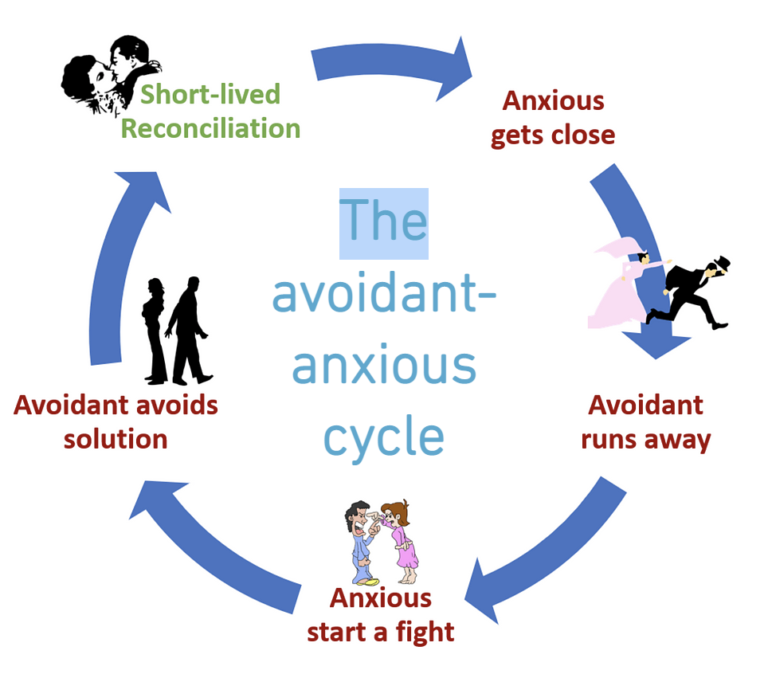

# Dating
https://www.freetoattach.com/dating

People in an avoidant attachment pattern tend to attribute their single status to external circumstances and not having met the right person. When in a relationship they will suffer from a lingering feeling that something is missing and something else is just around the corner, forgetting the sadness they felt alone. They can get into relationships easily, but a few months in a switch will flip and they begin feeing overwhelmed, smothered, their personal freedom encroached upon and start thinking about all the missed opportunities. Minor differences are perceived as a death knell for the relationship, and the closer someone tries to get the more they will pull away. This is because, while like all of us they are wired for connection, in need of stable attachment and may believe very much they want a relationship, the desire is different from the reality, where unconsciously the close presence of an attachment figure is inherently threatening. So they are not trusting by nature, and inwardly more comfortable in pursuit than in the stability of feeling loved in long-term relationships.

## 1. Dating Behaviours

### Early interest

Avoidants may not initiate things as they prefer not to be vulnerable. They prefer relationships in the early stages (“honeymoon period”), where they are at their best and most happy being open and sharing, while there is a measure of distance, partners are not leaning on them and no one's flaws are very visible. As soon as there is a necessity for extra closeness they start to panic, feel guilty and close off the closer they get, backing away when it moves to a level of intimacy that requires conflict resolution and vulnerability. So the longer they are in a situation which doesn't require closeness or strong emotions, the longer they may stay. This means avoidants invest much more in the beginning of relationships than in the later stages. This way they can enjoy the exciting aspects of early relationships while escaping when a deeper connection threatens to form. This can make them charming daters but upsetting long-term partners. Their avoidance can produce intrigue and sparks for partners initially, by triggering the attraction system with intermittent reinforcement or by appearing as a strong, alpha male. Underneath this, avoidants want their practical and immediate needs met by a compliant partner (like we all do), but often don’t want to or fear they can't meet the needs of others at heart.

Avoidants do not usually fall for people quickly and their attraction is built up slowly over time, through trusting in the safety of repeated, emotionally non-threatening communication. Often charming and with good social skills, they use more touch, eye contact and validating behaviours early in the dating process. Modern technology suits avoidants perfectly - they can appear to be giving someone a lot of attention with constant messages etc, without actually offering too much time face to face. This initial stage will often only last as long as it takes for the avoidant to feel certain of the responding partner's affection. As things progress (and because they ultimately struggle to voice their own boundaries) they unconsciously need to police intimacy to feel in control, not giving too much back - they may, for example, be the one to shut down conversation, or just not proactively ask too much themselves.

> "I normally find people thinking they're close to me when they're not, so I kind of give them enough for them to think they're close, but I'm always miles away... I don't really tell them much about myself and just let it be one way. I'm generally uncomfortable in social interactions. I think it's partly because I don't have much of a sense of a self-concept. I don't really have a strong sense of self. I tend to adapt myself according to the people that I am around and what they need me to be." (the 'False Self' defence)

Avoidants will avoid going into anything too personal, and there is not much real conversation of values, wants, needs or what each partner is looking for. They can use humour or changing the subject to diffuse situations that might become too emotional. They may shame or resist displays of emotion and return to the limited connection with which they are more comfortable. Consciously or otherwise, they will have exacting standards to make most possible partners not good enough for them. So some look to date high status partners, although in the long term may be unable to healthily separate from and support their partner's achievements without it contributing to their own insecurities until they have worked on their own self-esteem; alternatively a few may date partners to whom they can safely feel superior.

### Physical touch, sex & casual dating

Many avoidants experience some degree of difficulty with close-up interactions, although this may not be apparent during courtship. Many did not experience a lot of physical contact as children, or did not receive the mixture of comfort and stimulation that comes from a parent gazing into an infant's eyes. They were likely not often soothed by physical touch from caregivers. Rather, the contact they did experience may have been overly intrusive or misattuned. As a result, many adult avoidants experience aversion at being what they perceive as too physically close to a partner. This aversion can include not only eye contact, but the near senses of smell, taste and touch. Many avoidants report feeling inexplicably irritated or even harassed by their partner's attempts to get near or to maintain close physical contact. They may feel at once intruded upon and ashamed of their aversive reactions, and may attempt to conceal it with avoidance, excuses, withdrawal or anger.

So avoidants have less of a love language around physical touch, particularly in public, as they tend to operate in their head rather than their body, can find physical closeness overwhelming, and being socially hyper-aware get easily embarrassed. They may receive less oxytocin enjoyment from it that most - "your partner wants to snuggle up with you on the couch, but you start to feel annoyed and angry with their clingy and needy behaviour". They tend to sexualise nurturing touch.

When in a relationship, sex is a safer domain where they can connect to someone without having to confront uncomfortable emotions – and access their somatic (bodily) sensations which they are often disconnected from. But they sometimes avoid physical closeness, and may become more physically/sexually withdrawn over time and begin to view sex as another obligation (more common in women than men). As even a partner's sexual satisfaction can become onerous, for some avoidants sexual behaviour is focused on the avoidant’s own needs, with blindness to partners' needs and wishes. For other avoidants, the bedroom may be a rewarding place where they can more easily understand their partner's needs.

Casual dating or no-strings sex can appeal, choosing relationships based on sexual chemistry instead of emotional intimacy. They may pursue sex while avoiding a relationship. For some there may be promiscuity promoted by insecurity, narcissism or a wish to elevate self image with peers, as avoidants tend to be very influenced by what their peer group think (safety having been programmed as not standing out from the crowd). In relationships avoidants are more likely to cheat, or deny their current partner affection while pursuing secretive sex lives, though on the flip side they are less likely to develop strong feelings for their affair partner (which is just as well). Avoidants do this to hold space but retain the balance of power, keeping their partner at a distance but on the hook. Looking for attention outside the relationship is something avoidants do when they feel too emotionally engaged and need to find a potential exit route to feel safer. Subconsciously they may want to be caught, because they want and expect to be punished in line with their view of themselves as inherently 'bad', they want to be prompted to finally appreciate the value of their partner in the face of losing them, and/or because they are always ready to exit relationships but seek an 'out' without having to initiate the drama themselves. When caught they are not loyal, will not protect their partner, and will be passive aggressive. Overall avoidants have shorter, more troubled relationships, and tend to divorce more frequently and divorce again if remarried (though of course many avoidants can defy this pattern, and they can be less likely to cheat once married as they have a strong sense of duty).

### Fear of getting trapped

Avoidant types can’t handle a partner getting too close emotionally, nor are they good at sticking to the commitment and responsibilities of a relationship. Often they like the idea of relationships but struggle with the skills, and ultimately shy away from the work required to make them a long-term reality. Avoidants can be very eager and full of hope in the early stages until doubts and fears set in. They can want a relationship until they are faced with the realities of being in one. It’s not their fault – though they can try, the hard work of making a relationship work innately makes them feel claustrophobic. Unconsciously or otherwise, avoidants are always on high alert about getting 'trapped' - because they never learned to trust in mutuality (see the origins page), it is innately hard to feel safe someone would respect their needs rather than just use them. Their experience of interaction can be one of being drained rather than being themselves. So an avoidant may feel less interested in the person the more invested that person becomes. It can be easier to be around people who do not show too much interest or attachment to them, not asking too much of them. They may feel they 'like' someone only when not completely certain that person will stay. In this situation they also anticipate being less likely to feel guilty about any avoidant behaviours, plus while a person doesn't like them too much it comfortably confirms their own negative self-worth.

The avoidant may pursue a partner in the beginning, being charming and interesting in courtship, and may enjoy the thrill of the chase. After acting very interested in the beginning, they may suddenly become cold or emotionally distant, leaving their partners confused and distressed. The partner may wonder if the original attraction was a lie. Not exactly - as lying has awareness. The avoidant has a lack of emotional connection to memories which allows for an inconsistency of feeling that is hard for others to understand. Once their partner becomes a reliable attachment figure (that is, once they are demonstrating the qualities that could actually make for a stable relationship), avoidant threat systems are activated and they may stop behaving well. Guilty over these sensations but simultaneously buoyed by the ego boost of safety and support that reliable attachment has given them (and with inherently low self-worth, avoidants need this external boost), they feel safe to exit. They are experts at extracting themselves from the messy consequences of their avoidant behaviours and likely to leave when you need them most. But then they never understand why the people they are attracted to never like them, while to those who like them - or once people like them, they aren’t attracted. However, they also fear wanting someone or belonging, as it makes them overly vulnerable.

> “Where people do have some attachment or positive expectations about me, I persuade myself that I will eventually disappoint them. I usually decide to minimise contact to try and lower their expectations that I will treat them well.”

Trust in getting close to someone is an expression of our trust in mutuality. For non-avoidants, distance and chase become unimportant (or less important) once people can enjoy the warmth of true connection, trusting reciprocation does not mean them being overwhelmed. But as avoidants ultimately cannot trust in mutuality to enjoy this, they are always reliant on the maintenance of a degree of distance to feel interested. Their experience of attachment is motivated by where they are on a continuum of fear relating to core wounds - either of being engulfed, or of being abandoned. So often their interest remains while their sense of the possibility of losing someone is real - which can run counter to the security needed for a stable relationship. Such is their fear, they often do not give enough for a partner to feel truly appreciated, safe and connected, which sabotages any blossoming relationships whether or not they consciously intended to.

### Disbelief in love & relationships

At heart, avoidants often believe that love doesn’t last and is inevitably disappointing. The find it harder to fall in love and doubt it’s possible or believe it is a fiction and a trap.  They may not want to be truly known, may believe there is no safety or security when open, and may subconsciously believe they’ll be hurt or abandoned. They want to avoid being ‘taken advantage of’, 'trapped' and ‘sucked in’. Despite this though, they still subconsciously seek out attachment, and are somatically (physically) affected by separation.

Avoidants are always prepared for a goodbye scenario because internally they assume it's the more natural resolution to every relationship. With low self-belief they easily fear not meeting a partner’s standards, and rather than - as a Secure would attempt - simply trying and believing it's possible to meet them, they anticipate being blamed when things go wrong in a relationship, so feel shame and head that off by avoiding too much responsibility and checking out early. It may lead to them being described as having a fear of commitment (being 'players' or serial daters), though it's actually because they take commitment seriously. What is in fact behind apparent commitment fears is an aversion to vulnerability and a low confidence-based assumption of failure. However, they tend to move from one attachment to another with little understanding of what really went wrong in previous relationships - avoidants have low self-understanding and often they'd rather not look into it.

> "In dating, avoidants can be charming and have learned all the social graces - they often know how they are expected to act in courtship and can play the role well for a time. But lacking a positive view of attached others, they expect relationships to fulfil a romantic ideal that no real human being can create for them, so all fall short and are discarded when it becomes inconvenient to continue. Typically as the relationship ages, avoidants will begin to find fault and focus on petty shortcomings of their partner. Because they are not really aware of their own feelings, they can't talk about them in a meaningful way, and often the first clue the about-to-be-dumped have that something is wrong is the avoidant's move to break up with them."
>
> \- Jeb Kinnison, Bad Boyfriends

Avoidant attachment: not to be confused with assholes. "Emotionally unavailable" people are mostly neutral and cold, but avoidants are capable of intimacy, until they subconsciously block themselves. And while the emotionally unavailable stay on an even keel, the avoidant goes through cycles of missing and then pushing the partner away. A**holes tend to be confident and not to care about their partners, but avoidants come in all shapes and sizes. They can be confident, but also shy and un-confident. They may care very deeply about their partner, while still being unable to provide on the intimacy level of the relationship without self-work.

> #### Avoidants and Modern Technology

> The new digital climate favours those with avoidant patterns because these impersonalised, mechanised forms of interacting support the avoidant person's reliance on distance - digital technologies are actually creating a more avoidant society. Technology functions as a screen between self and other so relationships and intimacy can be controlled, providing connectivity without too much emotional connection. As technology makes it easier to maintain a long distance relationship, more people are choosing to pair with a partner in another country of even continent. The digital world also provides escape for those with partners living closer to home, or in the same home: keeping up with work and social media can be a handy excuse for keeping intimacy at bay, while addiction to porn is another risk. For some avoidants, digital devices come to replace human beings as companions. Devices are more or less reliable and predictable, and being engaged with a screen can prevent the approach/intrusion of other people. Technology provides a kind of psychic retreat.
>
> On the other hand, there are aspects of the digital age that can be especially stressful for avoidant individuals; technology can make it harder for them to sustain a comfortable distance. Demands for access and response tend to be disturbing for an avoidant person. They may be able to resist the pressure to communicate, but resistance costs them energy and presents them with unwelcome emotional tasks: holding the other at bay, holding one's irritated response at bay. As part of a couple they tend to feel intruded on simply by the approach of their partner; if they are in a self-regulating state when their partner initiates contact they will begrudge the "effort" needed to make the response. This is not so much antisocial as it is energy-conserving. (see Autoreulgation on the Relationships page)
>
> \- Attachment & the Defence Against Intimacy

## 2. The Phantom Ex & Perfect Partner

### The phantom ex

An avoidant person often has a story of a perfect ex in a relationship that wasn’t fully realised, the 'one that got away’ to whom no one else can measure up. In reality the idealised relationship was often lacklustre or insecure and unlikely to be highly functional (for example, perhaps ending prematurely where there wasn't time to learn someone's flaws, because they were dumped, or with a frequently unavailable/disinterested partner, their needs and feelings often unexpressed openly, feelings of desire stemming from the insecurity of not knowing how the other felt or little real demonstration or expression of commitment, less time spent physically together alone or little genuine intimacy or effective communication - all things that would delay avoidant attachment defences kicking in. There may even have been some neglectful treatment which, instead of putting off, creates distance and fits with the avoidant view of themselves/childhood experience so made them want to try. If avoidants are accurate in remembering feeling comfortable and desiring at the time, what they are probably recalling is actually feeling detached, but typically they misremember that their avoidant triggers were kicking in). But with time and distance from that person they are free to pine for the long lost love from the safety of that person’s total unavailability, meaning their attachment desires can be activated, remembering only positive memories and convincing themselves that was the best partner they ever had, while minimising their ex’s imperfections or why the relationship failed. Avoidants are only able to fully appreciate the real value attachment holds to them in the face of real loss.

The phantom ex operates because there is/was distance, not because the relationship was successful. But a fixation with a past partner affects budding new relationships, blocking them from getting close to someone else. Just the knowledge that this person is out there is enough to make any new partner seem insignificant by comparison, a subconscious distancing strategy.  In doing so avoidants can convince themselves they are capable of true closeness and outsource the problem. In reality, were they to re-enter a relationship with this phantom ex and it were to be able to successfully reach the stage of a stable, mature relationship (unlikely), they would almost certainly start experiencing the same threat response to an attachment figure they do with everyone else.

> "I once had a partner that talked so highly of his ex, I never felt good enough. I constantly felt like he wished I could become her. But what I realise now is that he focused heavily on the good that came with his ex. He didn’t think about the reasons they broke up; he just wanted the good without the messy." This is kind of behavior is called romanticising, and avoidant people are often guilty of this. They’ll remember only the positives and never the negatives of their exes. An avoidant person wants the idea of love without being emotionally close. Because of this, they might continually praise their ex (openly or in their head) no matter how great you are. It’s not that there’s anything wrong with you; it’s that they’re focusing on only the positive parts of their past relationship. This puts a strain on any relationships and is a subconscious tactic to put you at a distance from them.

### The perfect partner

They also spend a lot of time and energy looking for “The One.” They create a fixed idea in their mind of how their perfect partner should be. This means they often have a tough time creating the compromises necessary to adapt to the needs and personalities of real partners. For example, they can expect frustrations, disagreements and a need for space should not arise in the perfect relationship (though this is in fact because deep down they don't have confidence in how to fix those things when they arise, for themselves or others). And they tend not to prioritise seeking the qualities that make for lasting relationships because subconsciously they are also characteristics that create intimacy, stability and responsibility (healthy boundaries, steady commitment and availability, emotional directness and validating behaviours, open communication and voicing needs, conflict resolution skills etc), which ironically means they may look for relationships that actually make them unhappy in the long-term. Avoidants are very good at finding dealbreaking pet peeves with prospective partners (e.g. “Omigod, his laugh sounds like a sea lion”). This gives them a subconscious excuse to maintain emotional distance while they wait for The One and keep their space. As they do they will reject many relationships that might overall be satisfying and worthwhile because they do not meet their expectations of the ideal.
​
But once in stable, secure relationships, they often complain about not feeling what they are supposed to feel. They dream of the perfect partner as a way of distancing from real prospects - they may even fantasise about being with other people as a distancing tactic, and believe when they meet the right person everything will fall into place, work effortlessly and they will be able to be really close and show love. But even when they do meet someone who checks their boxes, they still complain “by now I should feel in love,” “my feelings are not growing,” "I need to feel more in love"; - when they may in fact not know how to feel it as they are. Because close connection is inherently dangerous, and without work on themselves to become more comfortable with vulnerability, yearning may be as close as avoidants get to falling 'in love' early on. This requires distance (physically or emotionally), which works against compatibility and secure relationships, and is in fact the opposite of mature love.

Avoidant's value consistency, and tend to be very selective about who they share their time with. When people show any vulnerability or criticism they tend to be discarded. To rationalise their difficulty with closeness and expressing how they feel, avoidant's tend to have lists that get longer as time progresses. It is easier to rationalise that they have not found the correct person, by requiring someone who must fit all the criteria. If they meet someone who meets these criteria, in the long term they will start feeling vulnerable. But because the appearance of emotions feel like liabilities, they protect themselves by starting to expand on the requirements of the list. At a certain point the relationship becomes unstable because the requirements that keep the relationship afloat are unrealistic. They will use that rationality to justify the result - "they weren't able to satisfy all of my needs - they weren't the one". In focusing on these to protect themselves from their own vulnerability, they tend to neglect the needs of those that provide for them.

The phantom ex and perfect parter, dreams of a perfect past and perfect future, are two strategies that are highly effective at keeping avoidants from being fully invested in the present, and less emotionally available or invested in their partner - because in the present it is always important, through no real fault of their own, to hold space from an inherently threatening attachment figure.

> "Have you ever gone out with someone whom you think is amazing, but as you start to get closer, you become overwhelmed with the feeling that s/he isn’t actually so hot after all? This can even happen after you’ve gone out with someone for a considerable amount of time or very intensively, all the while believing that s/he could be the one, when all of a sudden you experience a chilling effect. You start to notice she has a weird way of eating, or that his nose blowing infuriates you. You end up discovering that after the initial exhilaration, you feel suffocated and need to take a step back. What you don’t realize is that this surge of negativity could in fact be a deactivating strategy, unconsciously triggering you to turn off your attachment needs. Not wanting to look inward—and believing that we all have the same capacity for intimacy—you conclude that you’re just not in love enough and so pull away. You partner is crushed and protests, but this only strengthens your conviction that s/he is not “the one.” Moving from one date to the next, you begin this vicious cycle over and over, believing all along that once you find “the one,” you’ll effortlessly connect on a totally different level.
>  
> This and the phantom ex are the two trickiest tools that you may be using to shortchange yourself in love. You convince yourself that you have a true longing for someone from your past or that the right person is just around the corner, so you can easily undermine yourself in love. Embracing the notion of the “perfect” partner is one of the most powerful tools an avoidant can use to keep someone else at bay. It allows you to believe that everything is fine with you and that the person you’re with now is the problem—he or she is just not good enough. In addition to creating distance between you and your partner, it can also confuse him/her; when your partner hears how you miss your ex, or how you long for the perfect soulmate, it leads him/her to believe that you’re craving true closeness and intimacy, when in fact you’re driving it away. "
>
> \- Attached by Levine & Heller

## 3. Who's Their Type?

### Who they go for

#### Assuming permanence with neglect

People in avoidant patterns can say they want a long-term relationship and really mean it, but because of deeper unresolved hurts it often doesn’t play out that way in real life. Once they're in one it eventually feels the opposite. Deep down they believe love has to be earned, so are attracted to qualities they perceive as challenging. Avoidants assume permanence, but with neglect: they may learn to attach to people who treat them badly and/or keep them at a distance, because it feels familiar - their understanding of a secure attachment figure. Unconsciously they do not expect to be left as they understand attachment figures as omnipresent and engulfing, so they seek out partners who are unlikely to leave through avoidant behaviours. But they also do not expect or perhaps even want to be treated well - it doesn't match up with their childhood attachment model and their sense of self, so they fear they'll disappoint. They may seek out neglectful partners, matching their low self-worth and childhood experience pattern of their needs being ignored. This can push them temporarily into a more anxious attachment pattern of insecurity trying to please the neglecter, which they then associate with desire - feeling comfortable being loved is not familiar. Consequently if a partner gives their love easily it may on the surface feel they are too boring, nice or smothering for them - but unconsciously it is unfamiliar and they may feel they cannot trust it. Avoidants are always on the run from their own emotions, so they will also look for people who are not going to elicit strong emotions or make them face anything openly, although ironically their very behaviours can be more likely to bring out strong emotions in their partner (see the relationships page).

#### Distant relationships & the illusion of intimacy

Avoidants tend to value the concept and safety of connection without too much real interaction and intimacy. Situations where they must show too much real commitment and interdependence risk exposing them to the emotional abandonment they experienced as children, so subconsciously do not feel safe and must be avoided at all costs (fear of commitment actually comes out of fear of abandonment). So distance is often built into their relationships: they may choose emotionally or physically unavailable partners, forming relationships with impossible futures or end dates, such as long distance, online virtual relationships, those who are already in a relationship, moving away or otherwise have little time for them. They miss their partners when away but quickly feel engulfed when they return. Impossible relationships are usually a conscious choice so avoidants don't have to deal with encroachments on their personal space or get too involved. The illusion of intimacy may be created without real life, the ordinariness of everyday routines and the potential for both conflict and genuine intimacy. Avoidants may have engineered a number of romantic pseudo-relationships in their lives that enable them go a long time without having to finally deal with the realities of real daily intimacy, conflict resolution, and the dangerous feelings of dependency this can incur. Unfortunately, this pattern only entrenches their habits and prevents them from learning vital relationship skills.

Avoidants may have never have moved in with a partner - or the relationship tanked when they did. A partner having any control over their living situation can be severely triggering. They may marry and have a family, but without work on themselves keep a certain distance that can leave their spouse feeling bereft and lonely (though interestingly children may be spared many avoidant tendencies, as, like pets, they themselves do not pose a threat of leaving). Within a family some might then even come to believe they are sticking around primarily out of commitment to the children, because while their partner is reliably present some struggle to access their real loving feelings (suppressing how much they do truly love and depend on their partner). Avoidants might even be attracted to people like partners of their friends, or friends of their partners, precisely because of the unavailability (though [forbidden crushes](https://www.psychologytoday.com/us/blog/lifetime-connections/202001/forbidden-fruit-wanting-someone-you-cannot-have?utm_source=FacebookPost&utm_medium=FBPost&utm_campaign=FBPost&fbclid=IwAR0eodSVJeFWogiLU0_b4r6VYt-CxxECPiujmNJdj16q3b6VnHk8KL4jCiQ) are common). While intimacy continues to be uncomfortable, the complication-free idea of distant alternatives will always feel compelling compared a relationship that has become close.

#### Complementarity or similarity

When we date, we seek wholeness for missing parts of ourselves at an unconscious level. This complementarity is a fundamental part of who we choose and what can bring balance to our partnerships (and, unconsciously, to our possible offspring). Psychodynamic theory suggests that we fall in love with people who carry a disavowed part of the self - this is the projected fit. We all secretly yearn for someone who can bring out the dormant part of ourselves that we desperately want to express. For the avoidant partner this is vulnerability and a longing for closeness. So when they are looking to connect, avoidants can be attracted to expressive partners or insightful ones, attracted to missing traits in themselves and unconsciously seeking out emotionally open people in the hope it will connect them to that aspect of themselves and bring out their self-understanding and expression of emotions. But without their own work they still find themselves largely unable to reciprocate. Similarly, when in the early dating stage an extrovert's tendency to fill the conversational space takes the pressure off the avoidant person feeling the need to disclose early on. The avoidant will feel more comfortable and attracted, and their partner feels reassured they are interested in them. However eventually the partner will realise the imbalance and invest more to try to rectify it and connect with the avoidant, which pushes them away. Conversely, avoidants may be attracted to someone who also doesn't reveal much themselves, the emotional distance keeping them comfortable and desiring, even if this can bode badly for lack of connection and communication breakdown later. Whoever they choose, the precise things that attracted them they may later start to label as a source of irritation, because it triggers the parts of themselves they may not in fact yet be willing to take ownership of.

### Pairings with insecure attachments

We love relationships that confirm our insecurities. If you pay close attention to the romantic relationships of your friends and family, you’ll see very clear patterns. You’ll notice that security stays in love with security, and insecurity stays in love with insecurity, even though those insecurities show up differently. Specific relationships evoke specific reactions. These reactions are then interpreted to confirm our internal beliefs about ourselves and others. In a relationship, people with bad attachment beliefs will reject and push away their partner who sees them positively to sabotage that view, until the point that this partner perceives them the way they see themselves. And when dating, people with negative self-views often choose partners who offer negative evaluations to confirm those self-views. The pathologies of these interactions then support their self-beliefs. People can also be attracted to those with a common level of woundedness for the reason we sense we will be understood. We all want to feel loved and understood. But without being able to love ourselves, we can abandon ourselves through repressing our own feelings, avoiding responsibility for them and pulling on others to provide us with attention or to feel useful, and turn to various controlling behaviours to fill the emptiness within that results from our own self-abandonment.

For avoidants, attending to someone else's needs is exhausting. They are attracted to other insecure attachment patterns because they sense it will allow them more freedom to go at their own pace. In other words, they tend to feel comfortable and have mutual attraction with people who also don't believe they deserve their needs to be fully recognised (sensing the avoidant will not provide for them, at least initially) and so are less likely to voice them and engulf the avoidant. Because subconsciously avoidants are also looking for people with whom they can be very confident they are safe from abandonment. They may learn to get their needs met through non-demanding partners who fail to require real reciprocation, intimacy, conflict resolution and positive reinforcement, pursue indefinitely if they withdraw (the obsessive types who call twenty times a day), and give without being asked. An avoidant can receive love from these people without having to give too much back or show too much of themselves, accepting attention without providing emotional security- a classic and often long-standing pairing of the anxious-avoidant relationship.

#### Avoidant - Anxious Pairing

Subconsciously, an avoidant feels reassured and in control by sensing the anxiously attached is unlikely to leave them even if they give little – and they would be right. Anxiously attached individuals, carrying their own childhood wounds, may act out (sulking, manipulating, criticising, becoming demanding or controlling), but will exist unhappily in a relationship and put up with a lot before choosing abandonment. Not having received consistency from caregivers, the anxiously attached expect to have to work to win love. They have trouble being single, can be rarely out of a relationship but are experts at picking those who won't love them, and can succumb to unhealthy or abusive relationships. The anxiety of an insecure attachment is enlivening and familiar to the anxiously attached, though it’s also uncomfortable and makes them more anxious. It validates their abandonment fears about relationships and beliefs about not being enough, lovable, or securely loved, and little genuine intimacy is achieved.

So avoidants know that all they have to do to trigger their partner’s fear and reconciliation is threaten to leave. Subconsciously avoidants believe that being in control this way (in a way they could perhaps not be if with a secure partner) will allow them to escape being drained, engulfed, and controlled, and at a deeper level to avoid being left themselves. They also use the insecurity of anxious behaviours to validate their deeply held beliefs about how draining relationships are and the need for independence, and avoid the demand of a deeper connection. So for an avoidant this relationship both effectively satisfies their internal need for control (after the trauma of feeling out of control around caregivers in childhood) and confirms their worldview.

Consciously avoidants fear intimacy, but unconsciously they fear abandonment - the opposite of the anxiously attached (while the anxiously attached fear abandonment and believe they seek true intimacy, unconsciously they are actually attracted to avoidants because, like them, they are not used to it). Often these relationships can produce a lasting dysfunctional equilibrium as they fall into a pattern of chaser-chasee, which are roles both these types need in order to feel comfortable with intimacy, in a push-pull cycle with each is triggering the other’s attachment wounds. Unlike those securely attached, pursuers and distancers aren’t skilled at resolving disagreements. They tend to become defensive and attack or withdraw, escalating conflict. And in fact without the distancing, chase, conflict, or compulsive behaviour, i.e. in a secure relationship, both types would begin to feel depressed and empty due to being used to painful early attachments. The sexual relationship is typically set up primarily to meet the avoidant's sexual needs (which the anxious partner entertains as a proxy for intimacy), although with a female avoidant sex may eventually become absent, and their partner become sexually passive.

Researchers found that avoidant individuals actually prefer anxiously attached people above all others, and vice versa. Each reaffirms the other’s beliefs about themselves and about relationships. The avoidants’ defensive self-perception that they are strong and independent is confirmed, as is the belief that others want to pull them into more closeness than they are comfortable with. The anxious types find that their perception of wanting to be closer than their partner can provide is confirmed (this is largely a mirage - if they truly received this closeness they might not want it), as is their anticipation of ultimately being let down by significant others. While they have a core wound of being too much, avoidants have a core wound of not being enough. So, in a way, each style is drawn to reenact a familiar script over and over again. This kind of complementary dysfunction can lead to a stable relationship, but one where both partners stay in their insecure styles, with the preoccupied battling for every scrap of attention and the avoidant one only giving enough to confirm his view of attachment as a necessary evil.

Unconsciously seeking to repair their core wound, the anxiously attached may be attracted to the opportunity to prove to an abandoning-orientated (i.e. avoidant) type that they are worthy of not abandoning. This partial response of intermittent reinforcement is what they remember from significant caregivers, most typically their father, and the familiarity of this yearning is itself attractive. But avoidants can so rarely provide validation that the anxious partner becomes painfully locked into seeking validation they will never fully receive. Pursuers may confuse their longing and anxiety for love rather than realizing it’s their partner’s unavailability that is the problem. It’s not themselves or anything they did or could do to change that. They hang in and try harder, instead of facing the truth and cutting their losses. And avoidants need someone pursuing them to sustain their own emotional needs that they largely disown (such as support, safe attachment, validation, connectedness) and which wouldn’t be met by another avoider. They can feel safe they can receive validation while not showing too much of themselves - but their partner's pursuit only encourages them to push away further, bringing out yet more avoidant behaviours. A couple can get locked in this pattern, largely because they each see the other as the cause, rather than a pattern between them that simply needs addressing and can potentially be stepped away from while within the relationship - by fully recognising what is happening and better providing for each other's needs.

> "A partnership between an avoidant and an anxious is common and forms a ‘demand/withdraw cycle’ that can lead to stress and crazy behaviour, and is predictive of violence. This persistent bond is based on the unmet needs of the anxious partner and the willingness of avoidant to accept attention without providing security, and results in mutually reinforcing insecurities. The anxious partner may be afraid of rejection or abandonment with a strong need for love and attention. When their partner is non-responsive, their protests intensify, there may be difficulties managing anger, and they may strike out as a mean to regain proximity.  A secure is likely to give up, whereas an anxious-preoccupied will stick with a bad relationship. This forms an interlocking dependency full of stress. While the dismissive enjoys control and confirmation of beliefs, as well as the ego-boosting (and so may settle in), the anxious sticks around unhappy with feeding on crumbs. Real closeness triggers the avoidants anxiety, and their distancing triggers requests from their increasingly anxious partner."

Read [this](https://www.kylebenson.net/toxic-relationship-2/) on the avoidant-anxious relationship.

#### Avoidant - Avoidant Pairing

While an uncommon pairing because of its inherent instability (both are more comfortable exercising the balance of power), it's possible for avoidants to form superficially functional relationships with other avoidants, in the early stages both providing the space, emotional unavailability and consequent pursuit the other enjoys. On the surface this might look like the ideal long-term partner - comfortably distant (if they can manage to still be reliably interested), unburdensome and inattentive to each other's needs. In particular this would satisfy core needs of volition/empowerment/control and privacy - both safeguarding from feelings of engulfment. Replicating the caregiver dynamic, if someone is fairly disinterested the avoidant could feel safe from being noticed too much or thought well of in ways they fear they'll disappoint. And they may have less fear of hurting each other with their actions and the guilt that would entail (although in reality capacity for hurt is equal, just expressed in different ways). So this may particularly appeal to avoidants whose caregivers who didn't pay attention to them - they unconsciously seek a parter who doesn't pay attention, to recreate that old hurt. Because the avoidant assumes permanence, but with neglect. When on a deep level we have felt abandoned either emotionally or physically, we may also unconsciously date abandonment-orientated people, seeking to change the script this time round and bring it back into our control. This is something all insecure attachment styles can experience.

> "Avoidants may become become attached to someone who exhibits characteristics that remind them of the emotional abandonment they experienced as a kid. This counterintuitively produces a sense of safety because it is familiar, but at the same time there is a deep desire for unconditional love from a person who is unwilling or incapable of giving it. Interestingly, if the partner were to become emotionally available, the avoidant would immediately bolt because intimacy is unknown (they never witnessed or experienced it before) and therefore very scary."

Two avoidants are unlikely to require overt affirmations of commitment or set healthy requirements from each other, so don't tend to exit on the basis of such discussions (see the Breakups page), but both find it difficult to commit to forming an intimate relationship in the first place, typically causing it to eventually fade out. Each avoidant may, though they cannot explain it, get a feeling of greater safety and comfort not to be engulfed by someone else's needs. They feel safer that they will have less to (fail to) live up to. But in fact the reverse is true: because neither is adept at expressing their needs, interpreting the other's or resolving conflict, this unsafe pairing hastens the likelihood and unpredictability of a breakup. Unable to recognise and own what it is they need, they each feel frustrated, silently blame and want to escape the other for not magically inferring this. And while they may give each other the space to each long for each other so feel desire (avoidants are typically most comfortable in a state of separation and longing rather than togetherness, and don't inherently expect their needs to be met or good treatment), neither is adept at making the other feel particularly good about themselves, or providing opportunities to rewrite the old wounds of emotional abandonment with a new paradigm of love and support.

Within a relationship, these couples can live very disconnected separate lives, coexisting fairly disinterestedly, do not give each other the positive reinforcement, interest and support they require or attend to the important emotional needs their partner struggles to access, sex tends to be infrequent and impersonal, and the overall tone of the relationship is usually unhappy - they tend to keep each other at arm’s length, doing their own thing and remaining too afraid to show, discover and accept each other's inner world. Neither is good at calming, comforting or physically soothing the other, a physical distance which can come with an anxiety and health pricetag. Ultimately neither is able to show that much close care for each other, because they don't want to access their own or the other's emotions. The relationship becomes a legitimate, socially sanctioned way of avoiding intimacy. The overriding emphasis is on incessant activity (both may work long hours, for example, or fill their weekend schedules, and this pairing can be seen among busy young professionals or those who travel a lot, lack of closeness built in by their schedules), avoiding deeper intimacy and seeking to look as though they have a successful relationship, even if it isn't emotionally satisfying for either. They may choose a partner based on status. The focus becomes on having the right clothes, jobs, friends, holidays etc, and unable to get in touch with what are in fact their needs for missing true closeness and support, they may silently critique each other for these reasons. This attempt to earn the approval of external others can lead to a life of quiet desperation. While avoidants tend to drift apart, when the status of their continued relationship prevents separation or divorce, they may cope with the lack of intimacy by withdrawing or infidelity, trying to outdo each other in how little they need the other.

Functional relationships require constant couples communication about needs, something neither is adept at, and they both find it difficult to read the needs of other. For dating to progress, avoidants need someone willing to be vulnerable about their interest in them and be steadfast in their commitment so they have something to react against, as well as someone to attend to their emotional needs they struggle to connect with (on some level avoidants do actually crave this closeness even though they simultaneously fear it - they are just unable to own and seek it themselves, and so reliant on another). With neither avoidant partner keen to express their feelings and needs or substantially attend to the other's, to increase intimacy that can move the couple towards feelings of love, and to resolve conflicts, and neither able to really help the other to open up, these impersonal relationships can be full of suppression, unspoken frustrations, and descend into unhealthy behaviours with both stonewalling or pushing the other away, each triggering further avoidance in the other - a cycle of mutual rejection that neither has the inclination or tools to step outside. As each withdraws in their automatic attachment response, the other withdraws further. So they easily fall apart and are the least likely of all pairings, hard to develop enough initial interest in each other to even get off the ground.

> "Avoidant people are sometimes attracted to people like themselves, and can be comfortable until one or both of them has a level of distress that cannot be stemmed by their combined pattern of minimising. At that point the relationship can break down very fast as both are inclined to withdraw. Two avoidant people form pseudo-secure relationships that can look quite companionable but actually lack any depth and intimacy and cannot survive challenges. Partners do not notice the complexity of the other, any novelty would threaten the false sense of security, and so curiosity is shut down. Partners value the implicit proximity to their primary attachment figure without the challenge of real emotional proximity which always threatens to interfere with the avoidant's strategy of auto-regulation. These are brittle relationships that lack the capacity to repair ruptures."

Commonly one partner is more avoidant than the other, which creates the illusion one partner is needier than the other early on and can discourage both. Alternatively, partners may switch between the one pursuing and the one pulling away, as each tires of pursuit and becomes quietly revengeful, creating a relationship of silent drama which is toxic and inevitably disintegrates. They each orbit in their own pattern of rejection and desire which may rarely align, so this pairing lacks the stability of a consistently committed partner. Each operates uncollaboratively by protective instinct, and together they struggle to move the relationship up to the level of thinking like a team (interdependence) - without which a couple is not strongly bonded, so other connections may become more appealing over time. This couple tend to resist moving forward to different life stages. When relationship problems arise - as they inevitably do – both are stubborn, feel the need to retain control and struggle to show the vulnerability needed to fix things, neither is very good at reading what the other wants, nor wants to or understands how to resolve things. They instinctively move away from each other, rather than towards each other to fix things together. They are both quick to think negatively of each other and to assume something cannot be solved, and both find it hard to develop a lasting emotional attachment. In this situation there isn't a partner willing/able to do the important communication and collaboration work, both have a sense of 'why bother?' and are inclined to just walk away, so these relationships end under even minor stress. Breakups for this pairing easily happen without warning and can be particularly confusing as neither shows much emotion nor is able to talk very openly about what went wrong.

Avoidants cannot be twisted into interdependence, compromise, intimacy & openness, vulnerability or conflict resolution until they have owned their patterns and are willing to give it, which is possible for them to learn by mirroring so particularly difficult to develop with two uncommunicating avoidants - who would each be opposed to being unilaterally vulnerable and resist any form of conflict required to fix things openly. To get through the rough patches, a successful couple really needs at least one partner who is willing to stick it out and make the effort to work through the tough times.

> "Without the help of a partner, avoidants are unlikely to understand who they are, recognise their deep-seated existential loneliness, or ultimately overcome their anxiety about intimate relationships. They need to be met with understanding partners who will make an effort to find out what makes them tick. This isn't to say it's impossible for two avoidants to create intimacy that sustains a relationship. But without some form of help. the odds are against it" 
>
> \- Stan Tatkin, Wired for Love

On a very unconscious level, to avoid engulfment the avoidant person ultimately desires a partner who is consistently present (ideally in another space) but rarely interacting directly (except on the avoidant’s instigation, which they can cope with), who does not really notice or need to fully know (and so expose) them, and expresses no great needs or demands. But in both types of insecure pairing explored above, the wished-for scenario is available only in the domain of one-sided attachment (i.e. parent-child relationship).

It's not that either relationship couldn't be successful with work (and without work others can be long-standing, even lifelong, though both not very happy within it). Everyone has a natural style and depending on how strongly each shows up on the attachment spectrum, certain attachment styles do not preclude good relationships - it simply means couples have to take responsibility for how they might trigger each other and for good communication. But couples would need to each recognise and take responsibility for their own patterns and the self-abandonment it springs from, to be happy. Healthy romantic relationships require internal connection, acceptance and self-esteem so partners are no longer expected or wished to act as parents—to fulfil a long-unmet need. Essentially, avoidants would prefer things to stay always in the courtship phase, but relationships must become more intimate, with both feeling safe to express their needs, to believe those needs deserve to and would be respected, and to rely on each other, or they don’t survive.

Until avoidants can redress these unmet needs themselves rather than looking outside, and attend to their fears of engulfment and abandonment, they will be stuck on dating repeat. Because the more avoidant behaviours show up in the dating process, the more likely that person is to attract other insecure attachment styles  (of which there are a [greater number in the dating pool](https://jebkinnison.com/2014/06/23/dating-pool-danger-harder-to-find-good-partners-after-30/) because secures tend to stay in relationships - "those past 40 who have never been able to get and keep a good relationship going, likely never will—unless of course they have realised they need to change and work hard on themselves."), or indeed to bring insecure attachment out of more secure, better communicating partners.

For instance, a man who is avoidant may be able to successfully shirk a secure woman’s pushes for increased intimacy. After which, the secure woman will accept the rejection and move on. But an anxious woman will only become more determined by a man who pushes her away. She’ll resort to calling him for weeks or months on end until he finally caves and commits to her. This gives the avoidant man the reassurance he needs that he can behave independently and the anxious partner will wait for him. Secures require more reciprocation in order to provide the validation avoidants require, and other avoidant partners would struggle to provide validation at all. Avoidants are also likely to be put off by a secure person's forthright, open requests and expectations to meet their needs, and secures not likely to hang on in the long term without their needs being met. So before they work on themselves, avoidant types can be so good at putting others off that oftentimes it’s only the anxious types who are willing to stick around and put in the extra effort to get them to open up, keeping the emotional labour for keeping the relationship going on their partner.

The less avoidants feel someone needs them, the less potential they feel they have to feel guilty, which for them can be overwhelming. But everyone has needs - insecure styles simply don't believe they deserve for them to be recognised as much, so are better at suppressing their needs - which just means they come out in more unhealthy ways. The key to a successful relationship is not to find a partner who doesn't express their needs, but for us to work on ourselves so we can express our own, do not feel overwhelmed by the prospect of meeting a partner's needs - and with boundaries comfortable remaining close when we can't (with the skills to be effectively supportive but safe in the knowledge we can't and shouldn't always look to solve someone's problems).

A warning to look out for: adults who were routinely overlooked in childhood often have trouble recognising toxic patterns - this applies to all insecure styles. They tend to tolerate stonewalling precisely because it's familiar, and to rationalise their partner's behaviour thinking they're perhaps too stressed to talk things through, to blame themselves or to castigate themselves for having a need in the first place. They are also quick to doubt whether their perceptions are valid so can be controlled by gaslighting. Stonewalling is never an appropriate response.

### Pairing with the securely attached

Many people with avoidant characteristics, however, have happy and fulfilling relationships through which they move towards a secure attachment pattern. It's possible to do this with any partner provided both are aware of their own attachment triggers and dedicated to putting in work, but an avoidant person's best bet is with a partner exhibiting some secure characteristics - comfortable resolving conflicts, addressing relationship challenges openly and non-defensively, comfortable with both intimacy and independence, able to show sympathy to avoidant behaviours and give the avoidant partner the space they need without pressure, but also confident articulating their needs and able to draw clear boundaries against mistreatment - if necessary walking away.

However the opposite can also be true. When dating, avoidants tend to find the open communication of needs by the securely attached intimidating, exhausting and overwhelming. Likewise, a secure partner my find an avoidant's needs for the absence of interdependence too much to handle long term. And in a relationship two people need to show up to do the work - without awareness of the dynamics at work, it's common for the avoidant to start pulling out insecure elements in their previously secure partner. While research shows that an avoidant who enters a long-term relationship with a secure can be “raised up” to the level of the secure over an extended period of time, unfortunately, they are also capable of “bringing down” a secure to their level of insecurity if they’re not careful:

> "The avoidant will tend to drive the secure partner toward attachment anxiety by failing to respond well to reasonable messages requesting reassurance and to show willingness to resolve relationship challenges together. An extremely secure partner can gradually change the insecure partner toward more security, but at great cost in patience and effort. If the avoidant recognises the problem and takes some responsibility for trying to respond positively even when he doesn’t really feel like it, this can gradually reorient the avoidant partner toward more satisfying [couples communication](https://jebkinnison.com/2014/06/14/the-science-of-happily-ever-after-couples-communications/). If this does not happen, a Secure is more likely to give up on the relationship and move on"

However, be aware of falling into the myth that there is a perfect partner who can solve this (a common avoidant defence mechanism!). It is simply not the case. It is common, perhaps expected, for relationships to suffer from maladaptive patterns over time, and the push-pull dynamic is something it is easy and common to fall into. These patterns are fixable when both partners own their piece and do the work. The above descriptions of insecure pairings are more extreme examples for couples who register at the stronger ends of the spectrum (or trigger each other to be that way), and simply describe the problems that can arise when people aren't self aware.

So beware also of using attachment theory as another distancing tool to blame your partner and mark them 'unsuitable'. Attachment theory is simply a tool to recognise very changeable dynamics that partnerships can sometimes slip into. If you are an avoidant be mindful that you might be tempted to label most people you date as anxiously attached, first for expressing any needs at all, and second because avoidant behaviour often brings out anxious responses in everyone. It can be likely your partner is not always this way, and most importantly, with self-awareness, entering into this pattern is a choice you can decide together not to opt into. 

The important thing is internal ownership rather than the misnomer of roaming the world to find one of these magical partners called “secures” to resolve our problems (with whom there may well not be mutual attraction in the first place). We all have some avoidant parts. We all have some anxious parts. We all have some secure parts. These are just natural ways we can respond in different situations. Almost everyone can display insecurities when the situation is stressful or their partner is triggering, such as anxiety when responses are withheld. Understanding and owning our patterns can bring us back towards secure functioning. So we must locate the problem in the pattern and realise that changing our relationship to a partner is possible with ownership on both sides, rather than assign it to our partner. These attachment styles are not essential traits but strategies that can be modified - if the partners are willing to show up and do the work together.

Many couples, for example, who slip into anxious and avoidant roles, love each other deeply and are able to fix the pattern between them. Attraction between such partners does not rest on a confusion of chaotic feelings that come from attachment distress with genuine love, the idea of which is misleading and does not do justice to the meaningful and deep connection partners in this pattern have to each other. This pairing can create a depth and breadth of understanding and compassion that other pairings don’t have — if the partners are willing to ask for what they need and work together. Likewise, if two avoidants can get a relationship off the ground, find a way to voice their needs so problems don't remain unspoken, somehow both work to resolve conflicts, and resist isolating or walking away, then they can still create a satisfying connection (even if it might look insufficient to others), coming together only when they wish.

Any pairing has the potential to be successful as long as both parties are prepared to put in the work. And fundamentally, people are also much more complex than simply their attachment patterns, and there are very many qualities that go into a good match. The problem is, most avoidants are not willing to change their behaviour and undergo any painful introspection - they would rather leave the relationship. The idea of work in relationships is one of the things that can send avoidants running for the hills - they don't understand how to do it, fear failure, and so it is often easier to use it as an excuse that things 'aren't working' (without really having tried) and a partner is once more 'not right' for them.

### Beware: the limitations of partner choice

A secure partner may theoretically be ideal, but it is often the case that such a secure type may not be attractive - and for good reason. You would have a lot of difficulty through conscious intention somehow causing yourself to be interested in partners who do not register to your unconscious mind as exciting or familiar in any way. Every person has an early imprint or working model of what they find attractive and exciting, based on experiences with those closest to them. People who initially register as boring, unexciting or unattractive to us do so for an important reason—they are people whose “crazy” does not fit our “crazy” in a way that has the potential to heal us and teach us the most important lessons about ourselves that we need to learn. And we seek out people who have the capacity to understand our internal struggles. 

If we really wanted to be dating certain people, we would date them. There is something that draws us to the people we date, even if there are things about the experience that frustrate us, and until our preferences change it may be better to try to work on ourselves within these. It is often the case that as we work on ourselves to become more secure we naturally become more attracted to more secure partners. But having a secure partner doesn’t mean you won’t have arguments, that things won’t get hard in your relationship, or that you will be together forever. You are still responsible for your healing - no one can do it for you.

> "It seems to me that having the expectation that we will begin a relationship with someone who has done all of their healing work and is “perfect” is unreasonable, because we are never "done" if we are staying awake in our lives and continuing to evolve. And unfortunately, some of the books and resources out there currently around attachment are setting us up for high expectations and big disappointment—just as movies and romance novels are telling us we should have something totally different than what any of us actually have in our relationships."
>
> [- Why you shouldn't avoid Avoidants](https://www.heirloomcounseling.com/blog/2018/8/27/whyyoushouldntavoidavoidants?fbclid=IwAR2iBcJc6bVLtQdwHlXp1-Vg4dMT-tquusyQ9oQUuBtdtKThySrf4zL9Z10)

Accepting who we are drawn to, how it may help us grow and what it can teach us about what we need is part of accepting ourselves as we are (while been willing to self-improve).  In any case, half the population has an insecure style - and more in the dating pool because secures tend to stay in relationships, and everyone displays these traits at times. We are attracted to who we are attracted to - embracing these desires can help us fully accept our partners and appreciate the real value they give to us, foibles and all.

But while embracing that, when single we can also be mindful to look out for characteristics we know could increase the chance of relationship success in the long-run. It’s important to be discerning when choosing a partner: but the most important characteristic is a belief in growth, and in putting teamwork into relationships. This trait can belong to a person with any primary attachment style. Prioritise a partner who is willing to learn, who understands their shortcomings and acknowledges their wounds, who is willing to do the uncomfortable healing. A partner who doesn’t have self-awareness or isn’t interested in growing with you is probably not a good bet. And while we may be attracted by the fantasy of someone a bit rejecting who doesn't seem to need us, every human has needs - this is what it is to be in a relationship. Being with someone who also doesn't want to express them can just cause frustrating, unhappy relationships in the long term and is less likely to last. Relationships are most likely to be successful with people who are able to be in touch with themselves, both willing to do the work, open to change (even if it’s difficult), and who are committed to working toward their best selves and best relationship, working at creating security together.

And if, for example, one tends to take on avoidant roles in relationships with partners who then respond more anxiously, there are a host of important questions to work through that won’t be resolved, but simply replicated, by switching partners. Such an avoidant person, to grow, needs to own that connecting to loving and desiring emotions is only possible for them at a distance, and they need to look inward to figure out what that is all about in order to stop acting in those ways. Could such a person operate the same way when a partner really rejects them, or would they in turn react anxiously themselves? How many times have we seen an avoidant person turn anxious when partners become truly unavailable, in the same way anxious types can become avoidant when actually presented with reliable love?

There are deeper dynamics responsible for attraction that cannot be resolved by switching partners. Insecure attachment styles are surface presentations of underlying dynamics that need to be worked through to be resolved. For example, if one felt unloved and constrained by either an overbearing or neglectful parent, happiness for that individual comes from finding a partner who at once resembles that familiar parent yet who is willing to expand and offer autonomy/care. What’s crucial is that the person in question does not simply desire autonomy/care from any random person— they desire it from someone whom they experienced as overbearing/neglectful. And you can bet your life that this individual will keep re-enacting this scenario by picking overbearing/neglectful partners and then struggle to twist autonomy/care out of them. Both pieces are important— the familiar and the missing quality. The best chance for growth and contentment comes when partners who are excited by a familiar unconscious bond both own their part of the pattern and agree to do the work together. Secure attachment happens over time. It happens as we build trust, as we show up for each other. It happens because we feel safe.